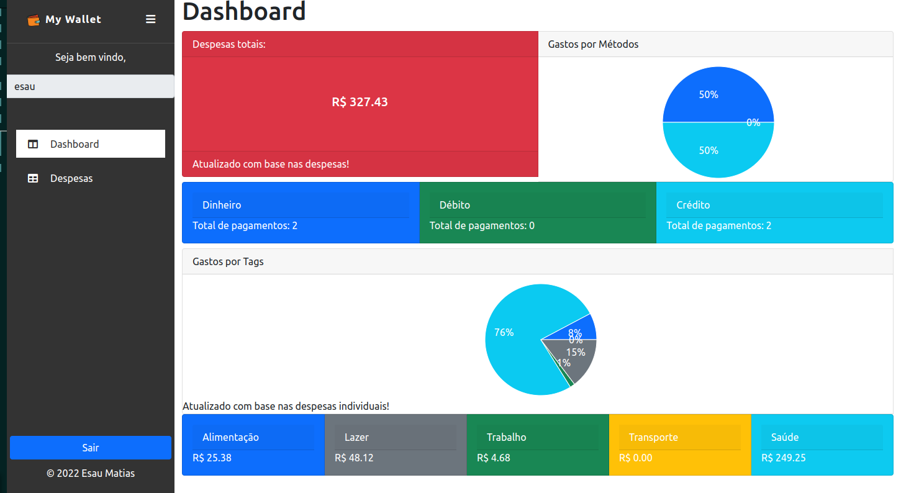

## Projeto Pokedex

_[Acesse aqui](https://mywallet-taupe.vercel.app/)_

### Contexto

Foi desenvolvido um portfólio de controle de despesas de conversores de moeda. Todos os valores são sempre convertidos para reais brasileiros (BRL). Você pode adicionar, editar e excluir uma despesa.

### Tecnologias usadas

>React, Context-API, Hooks, JavaScript, HTML, CSS, Bootstrap

### APIs usadas

_[Currency Quote API](https://docs.awesomeapi.com.br/api-de-moedas)_

### Instalação do projeto

1. Clonar o link do repositório git clone git@github.com:esaumatias/myWallet.git
2. Instalar as dependência necessárias para o projeto: ```npm install```
3. Iniciar o projeto: ```npm start```

;
